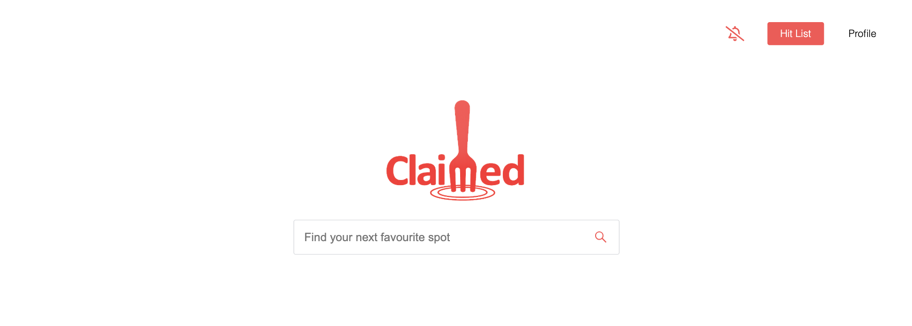
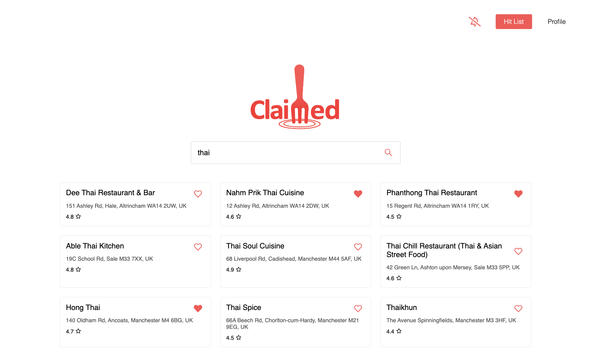
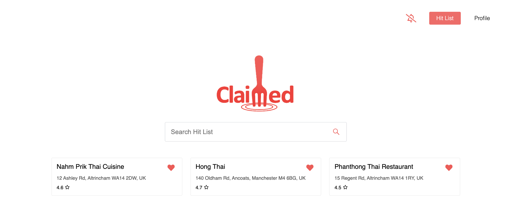
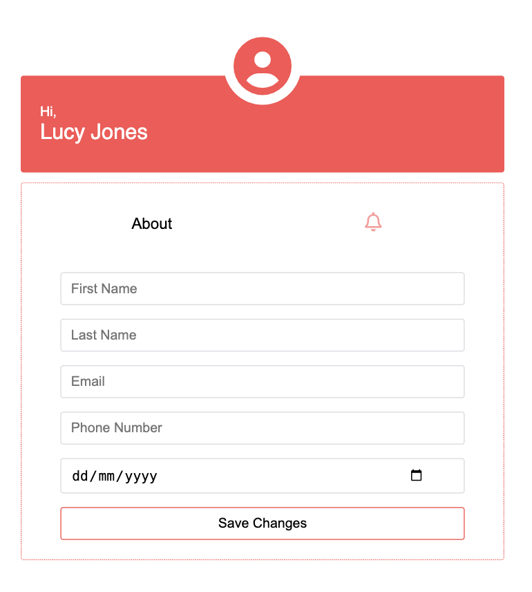
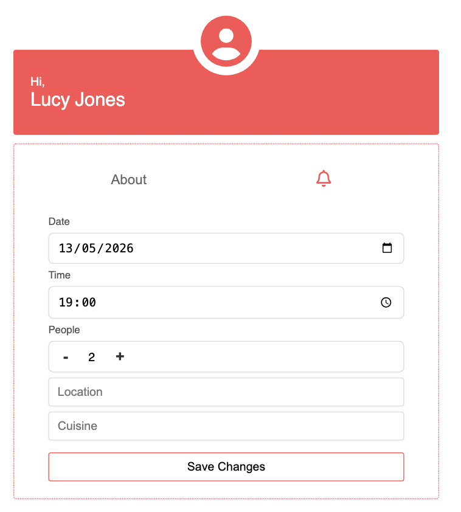
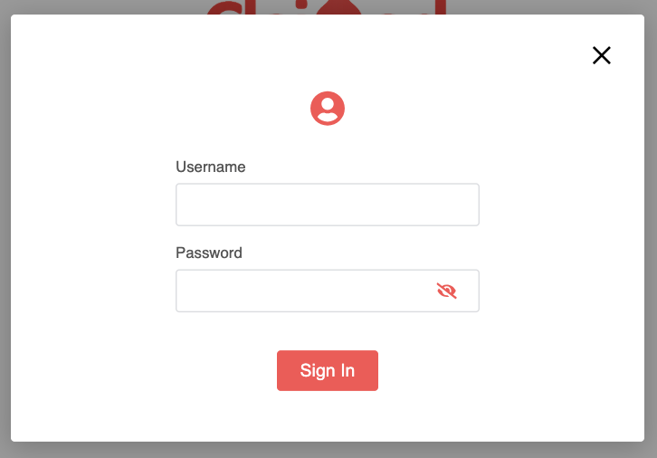
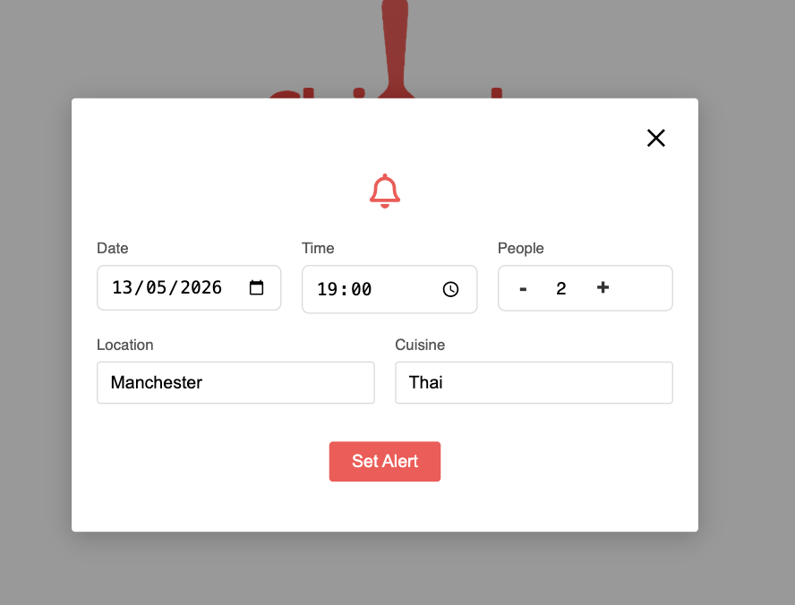

  

---

**Claimed is an online restaurant booking platform that helps customers secure reservations faster by letting them save their favourite restaurants and set alerts for table availability.**

This app was built using Vite [React](https://react.dev/)

Built from my own frustration with restaurant booking platforms, this app helps diners discover and secure last-minute reservations at places they actually want to try. I love exploring new restaurants and keeping a list of spots in my area, but existing platforms kept showing the same venues — including places I’d already visited or wasn’t interested in. The app is designed to help users track where they’ve been, tailor recommendations to their preferences, and avoid wasting time endlessly searching for availability.

---

#### User Experience

**HomePage**

  

  

**Hit List**

  

**Profile - About**

  

**Profile - Alerts**

  

**Sign In**

  

**Alerts**

  

